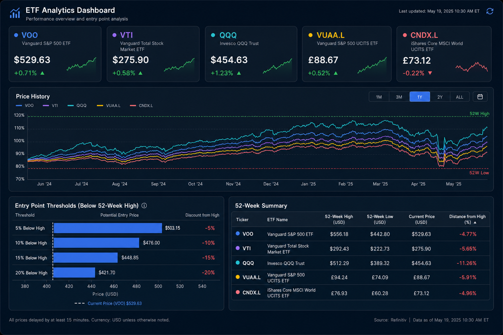

# Stock-Market v1 — Next Phase Plan

> **Status:** Pending review before implementation
> **Goal:** Replace the current static Chart.js visualization with a modern, AI-built Metabase dashboard. Archive the Investment Strategy Planner. Keep the full stack cost-free.

---

## Table of Contents

1. [What Changes and Why](#1-what-changes-and-why)
2. [New Tech Stack](#2-new-tech-stack)
3. [New Pipeline Architecture](#3-new-pipeline-architecture)
4. [AI-Assisted Dashboard Build](#4-ai-assisted-dashboard-build)
5. [Target Dashboard](#5-target-dashboard)
6. [Local Setup Requirements](#6-local-setup-requirements)
7. [Implementation Checklist](#7-implementation-checklist)

---

## 1. What Changes and Why

### What gets archived
- `website/investment-strategy.html` — Investment Strategy Planner is archived (not deleted)
- `website/js/investment-strategy.js` — archived alongside
- `website/css/investment-strategy.css` — archived alongside
- `analytics/etl/data_exporter.py` — JSON export to GitHub Pages is no longer the primary visualization path

### What gets replaced

| Current (v0) | Next (v1) |
|---|---|
| SQLite (`etf_database.db`) | PostgreSQL (Docker container) |
| Hand-written Python transforms | dbt Core SQL models |
| Chart.js static charts | Metabase OSS dashboards |
| GitHub Pages (static HTML) | Metabase web interface |
| Manual chart maintenance | AI-generated dashboards via MCP |

### Why dbt instead of SQLite transforms

- SQLite is a storage engine. The Python code in `db_manager.py` and `data_exporter.py` does transform work (currency conversion, metric calculations, threshold logic) that belongs in a proper transformation layer.
- **dbt Core** makes those transforms versioned, testable SQL models — easier to maintain, easier to extend.
- PostgreSQL is a production-grade database with full Metabase support. SQLite works locally but has no network listener, which limits deployment options.

### Why Metabase instead of Chart.js

- Chart.js requires writing and maintaining visualization code by hand.
- Metabase renders dashboards from SQL/MBQL with zero frontend code.
- Metabase's MCP server lets an AI agent (Claude/Sonnet in Cursor) build and update dashboards by prompt — no manual chart coding.

---

## 2. New Tech Stack

All components are **free and open source**. Nothing requires a paid subscription.

| Layer | Tool | Cost |
|---|---|---|
| Data fetch | Python + `yfinance` (unchanged) | Free |
| Database | PostgreSQL 16 (Docker) | Free |
| Transformation | dbt Core (Python package) | Free |
| Orchestration | GitHub Actions (unchanged) | Free (public repo) |
| Visualization | Metabase OSS (Docker) | Free |
| AI dashboard build | Cursor + Sonnet via Metabase MCP | Free (MCP is free on all Metabase plans) |

### Local runtime (Docker Desktop — which you already have)

Two Docker containers replace the current SQLite file:

```
Docker Desktop
├── postgres:16          ← database (replaces etf_database.db)
└── metabase/metabase    ← dashboard server (replaces website/)
```

dbt Core runs as a Python package inside the existing project — no extra container needed.

---

## 3. New Pipeline Architecture

```
Yahoo Finance (yfinance)
        │
        ▼
Python ETL (fetch only — analytics/etl/)
        │  raw OHLCV + FX rates
        ▼
PostgreSQL (Docker)
        │
        ▼
dbt Core models
  ├── stg_etf_data.sql          ← staging: clean raw prices
  ├── stg_currency_rates.sql    ← staging: clean FX rates
  ├── int_etf_eur.sql           ← intermediate: EUR conversion
  ├── mart_price_history.sql    ← final: full price history per ETF
  ├── mart_52week_metrics.sql   ← final: 52-week high/low/metrics
  └── mart_entry_thresholds.sql ← final: 5–30% entry point levels
        │
        ▼
Metabase OSS (Docker)
  └── ETF Analytics Dashboard
```

### What dbt replaces

| Current Python code | dbt model |
|---|---|
| `currency_converter_etl.py` | `int_etf_eur.sql` |
| `data_exporter.py` (metric calc) | `mart_52week_metrics.sql` |
| `data_exporter.py` (thresholds) | `mart_entry_thresholds.sql` |

The Python ETL layer keeps only its **fetch** responsibility (calling Yahoo Finance and inserting raw rows). All calculations move to dbt.

---

## 4. AI-Assisted Dashboard Build

Once PostgreSQL and Metabase are running, the dashboard is built by prompting an AI agent — not by writing visualization code.

### How it works

1. Enable the Metabase MCP server: `Admin > AI > MCP > toggle ON`
2. In Cursor settings, add the MCP server:
   ```
   http://localhost:3000/api/metabase-mcp
   ```
3. Prompt Sonnet (in Cursor chat) to build the dashboard:
   ```
   Build an ETF analytics dashboard. The database has tables:
   mart_price_history, mart_52week_metrics, mart_entry_thresholds.
   ETFs: VOO, VTI, QQQ, VUAA.L, CNDX.L.
   Include price history chart, 52-week high/low KPIs,
   entry point thresholds, and a summary metrics table.
   ```
4. The agent calls `create_question` and `create_dashboard` via the MCP tools — the dashboard appears in Metabase automatically.

### What the AI agent does (no manual UI work)

- Reads the dbt model schemas (table/column names)
- Writes and validates the SQL queries
- Creates each chart card (line chart, KPI, table, bar chart)
- Assembles the grid layout
- You review the result and iterate by prompting, not clicking

---

## 5. Target Dashboard

The dashboard below is the design target for the Metabase output.



### Panels to build

| Panel | Chart type | Data source |
|---|---|---|
| ETF KPI cards (price, daily change) | Scalar / KPI | `mart_price_history` |
| Price history (all ETFs) | Multi-line chart | `mart_price_history` |
| 52-week high / low per ETF | KPI or gauge | `mart_52week_metrics` |
| Entry point thresholds | Bar / table | `mart_entry_thresholds` |
| Summary metrics table | Table | `mart_52week_metrics` |

Time filters (1M / 3M / 1Y / 2Y / ALL) and an ETF selector will be added as Metabase dashboard parameters — no code needed.

---

## 6. Local Setup Requirements

> **You already have Docker Desktop. That is the only thing you need.**

You do **not** need to install:
- PostgreSQL — runs in Docker
- Metabase — runs in Docker
- dbt — runs as a Python package inside the project (no global install)
- Node.js / npm — not needed
- Any new IDE or tool

### What a `docker-compose.yml` will contain

```yaml
services:
  postgres:
    image: postgres:16
    environment:
      POSTGRES_DB: etf_db
      POSTGRES_USER: etf_user
      POSTGRES_PASSWORD: etf_pass   # stored in .env, not committed
    ports:
      - "5432:5432"
    volumes:
      - postgres_data:/var/lib/postgresql/data

  metabase:
    image: metabase/metabase
    ports:
      - "3000:3000"
    environment:
      MB_DB_TYPE: postgres           # Metabase's own app DB (separate from ETF DB)
      MB_DB_HOST: postgres
      MB_DB_PORT: 5432
      MB_DB_DBNAME: metabase
      MB_DB_USER: etf_user
      MB_DB_PASS: etf_pass
    depends_on:
      - postgres

volumes:
  postgres_data:
```

To start the full stack: `docker compose up -d`
To build dbt models: `dbt run` (Python command, no Docker needed)

---

## 7. Implementation Checklist

These are the steps that will be executed in order during implementation.

### Phase A — Infrastructure
- [ ] Add `docker-compose.yml` with PostgreSQL + Metabase services
- [ ] Add `.env.example` with required environment variable names
- [ ] Update `.gitignore` to exclude `.env` and dbt target/logs

### Phase B — Database migration
- [ ] Update `analytics/database/db_manager.py` to connect to PostgreSQL
- [ ] Update `analytics/database/schema.sql` to PostgreSQL syntax
- [ ] Update `analytics/database/init_db.py` for PostgreSQL
- [ ] Verify ETL pipeline writes correctly to PostgreSQL

### Phase C — dbt setup
- [ ] Add `dbt_project.yml` and `profiles.yml`
- [ ] Write staging models (`stg_etf_data`, `stg_currency_rates`)
- [ ] Write intermediate models (`int_etf_eur`)
- [ ] Write mart models (`mart_price_history`, `mart_52week_metrics`, `mart_entry_thresholds`)
- [ ] Add dbt tests for key columns
- [ ] Integrate `dbt run` into the GitHub Actions workflow

### Phase D — Metabase dashboard (AI-built)
- [ ] Connect Metabase to the PostgreSQL database (Admin > Databases)
- [ ] Enable MCP server (Admin > AI > MCP)
- [ ] Add Metabase MCP to Cursor settings
- [ ] Prompt Sonnet to build the full dashboard
- [ ] Review and approve dashboard in Metabase UI

### Phase E — Archive old visualization
- [ ] Move `investment-strategy.html/js/css` to `website/archived/`
- [ ] Update `website/index.html` to redirect or link to Metabase
- [ ] Remove `data_exporter.py` JSON export from CI workflow (or keep as fallback)
- [ ] Update `README.md`

---

*Documentation written for review. Implementation begins only after approval.*
